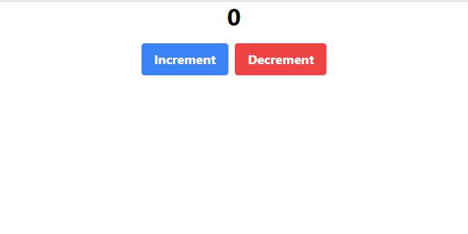

# Micro FE React + Vite + TailwindCSS and using in HTML

create Vite React with Typescript

```bash
    npm init vite
```

Add TailwindCSS for vite: https://tailwindcss.com/docs/guides/vite

Then we will change script at package.json little bit

```json
"scripts": {
    "dev": "vite --port 5001 --strictPort",
    "build": "vite build",
    "preview": "vite preview --port 5001 --strictPort",
    "serve": "vite preview --port 5001 --strictPort"
  },
```

After that we will run while coding as well

```bash
    yarn dev
```

Create Counter Component with styles

```tsx
import { useState } from "react";
import "./Counter.css";

interface CounterProps {}

const Counter: React.FunctionComponent<CounterProps> = () => {
  const [count, setCount] = useState(0);

  const handleIncrement = () => {
    setCount(count + 1);
  };

  const handleDecrement = () => {
    setCount(count - 1);
  };
  return (
    <div className="flex justify-center items-center flex-col space-y-4">
      <h1 className="text-3xl font-bold">{count}</h1>
      <div className="flex space-x-2">
        <button
          className="bg-blue-500 hover:bg-blue-700 text-white font-bold py-2 px-4 rounded"
          onClick={handleIncrement}
        >
          Increment
        </button>
        <button
          className="bg-red-500 hover:bg-red-700 text-white font-bold py-2 px-4 rounded"
          onClick={handleDecrement}
        >
          Decrement
        </button>
      </div>
    </div>
  );
};

export default Counter;
```

Add the Tailwind directives to Counter CSS

```css
@tailwind base;
@tailwind components;
@tailwind utilities;
```

At main.tsx change to with id "counter" will render your using in another host

```tsx
import React from "react";
import ReactDOM from "react-dom/client";
import Counter from "./components/Counter";

ReactDOM.createRoot(document.getElementById("counter") as HTMLElement).render(
  <React.StrictMode>
    <Counter />
  </React.StrictMode>
);
```

Also change id in index.html because we change the root id to counter id

```html
<!DOCTYPE html>
<html lang="en">
  <head>
    <meta charset="UTF-8" />
    <meta name="viewport" content="width=device-width, initial-scale=1.0" />
    <title>Vite + React + TS</title>
  </head>
  <body>
    <div id="counter"></div>
    <script type="module" src="/src/main.tsx"></script>
  </body>
</html>
```

Before change config we should install vite-plugin-css-injected-by-js, this package will make the CSS union into one JavaScript file

```
yarn add vite-plugin-css-injected-by-js -D
```

At vite.config.ts the setting to export file name Counter.js and it is the only file JavaScript in dist folder

```ts
import { defineConfig } from "vite";
import react from "@vitejs/plugin-react-swc";
import cssInjectedByJsPlugin from "vite-plugin-css-injected-by-js";

// https://vitejs.dev/config/
export default defineConfig({
  plugins: [
    react(),
    // this make CSS will have in JavaScript file
    cssInjectedByJsPlugin(),
  ],
  build: {
    target: "esnext",
    rollupOptions: {
      output: {
        // this make only make one JavaScript file
        inlineDynamicImports: true,
        name: "counter",
        entryFileNames: "Counter.js",
      },
    },
  },
});
```

Run build and Run Serve

```bash
    yarn run build
    yarn run serve
```

The Counter.js will able to use at http://localhost:5001/Counter.js you can click for check it also have code

## Running Test

Create HTML file make sure create div with id counter that we defined, and add script that import http://localhost:5001/Counter.js

```html
<!DOCTYPE html>
<html lang="en">
  <head>
    <meta charset="UTF-8" />
    <meta name="viewport" content="width=device-width, initial-scale=1.0" />
    <link />
    <title>Host</title>
  </head>
  <body>
    <div id="counter"></div>
    <script type="module" src="http://localhost:5001/Counter.js"></script>
  </body>
</html>
```

Run by anything you have



If you expect that use in other host like React, Vue that able to Components sharing or State sharing so you have to take a look at here: https://github.com/originjs/vite-plugin-federation
